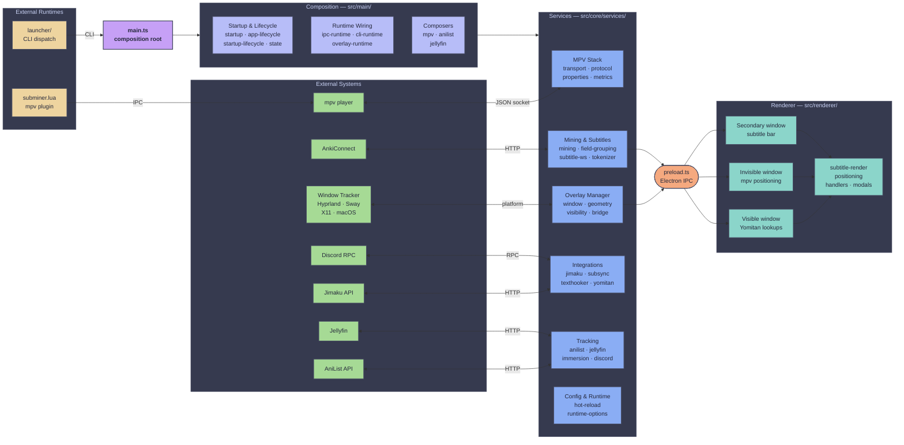

# Architecture

SubMiner is split into three cooperating runtimes:

- Electron desktop app (`src/`) for overlay/UI/runtime orchestration.
- Launcher CLI (`launcher/`) for mpv/app command workflows.
- mpv Lua plugin (`plugin/subminer.lua`) for player-side controls and IPC handoff.

Within the desktop app, `src/main.ts` is a composition root that wires small runtime/domain modules plus core services.

## Goals

- Keep behavior stable while reducing coupling.
- Prefer small, single-purpose units that can be tested in isolation.
- Keep `main.ts` focused on wiring and state ownership, not implementation detail.
- Follow Unix-style composability:
  - each service does one job
  - services compose through explicit inputs/outputs
  - orchestration is separate from implementation

## Project Structure

```text
launcher/                 # Standalone CLI launcher wrapper and mpv helpers
  commands/               # Command modules (doctor/config/mpv/jellyfin/playback/app passthrough)
  config/                 # Launcher config parsers + CLI parser builder
  main.ts                 # Launcher entrypoint and command dispatch
plugin/
  subminer.lua            # mpv plugin (auto-start, IPC, AniSkip + hover controls)
src/
  main-entry.ts           # Background-mode bootstrap wrapper before loading main.js
  main.ts                  # Entry point — delegates to runtime composers/domain modules
  preload.ts               # Electron preload bridge
  types.ts                 # Shared type definitions
  main/                    # Main-process composition/runtime adapters
    app-lifecycle.ts       # App lifecycle + app-ready runtime runner factories
    cli-runtime.ts         # CLI command runtime service adapters
    config-validation.ts   # Startup/hot-reload config error formatting and fail-fast helpers
    dependencies.ts        # Shared dependency builders for IPC/runtime services
    ipc-runtime.ts         # IPC runtime registration wrappers
    overlay-runtime.ts     # Overlay modal routing + active-window selection
    overlay-shortcuts-runtime.ts # Overlay keyboard shortcut handling
    overlay-visibility-runtime.ts # Overlay visibility + tracker-driven bounds service
    frequency-dictionary-runtime.ts # Frequency dictionary runtime adapter
    jlpt-runtime.ts         # JLPT dictionary runtime adapter
    media-runtime.ts        # Media path/title/subtitle-position runtime service
    startup.ts              # Startup bootstrap dependency builder
    startup-lifecycle.ts    # Lifecycle runtime runner adapter
    state.ts                # Application runtime state container + reducer transitions
    subsync-runtime.ts      # Subsync command runtime adapter
    runtime/
      composers/            # High-level composition clusters used by main.ts
      domains/              # Domain barrel exports (startup/overlay/mpv/jellyfin/...)
      registry.ts           # Domain registry consumed by main.ts
  core/
    services/              # Focused runtime services (Electron adapters + pure logic)
      anilist/             # AniList token store/update queue/update helpers
      immersion-tracker/   # Immersion persistence/session/metadata modules
      tokenizer/           # Tokenizer stage modules (selection/enrichment/annotation)
    utils/                 # Pure helpers and coercion/config utilities
  cli/                     # CLI parsing and help output
  config/                  # Config defaults/definitions, loading, parse, resolution pipeline
    definitions/           # Domain-specific defaults + option registries
    resolve/               # Domain-specific config resolution pipeline stages
  shared/ipc/              # Cross-process IPC channel constants + payload validators
  renderer/                # Overlay renderer (modularized UI/runtime)
    handlers/              # Keyboard/mouse interaction modules
    modals/                # Jimaku/Kiku/subsync/runtime-options/session-help modals
    positioning/           # Invisible-layer layout + offset controllers
  window-trackers/         # Backend-specific tracker implementations (Hyprland, Sway, X11, macOS)
  jimaku/                  # Jimaku API integration helpers
  subsync/                 # Subtitle sync (alass/ffsubsync) helpers
  subtitle/                # Subtitle processing utilities
  tokenizers/              # Tokenizer implementations
  token-mergers/           # Token merge strategies
  translators/             # AI translation providers
```

### Service Layer (`src/core/services/`)

- **Overlay/window runtime:** `overlay-manager.ts`, `overlay-window.ts`, `overlay-window-geometry.ts`, `overlay-visibility.ts`, `overlay-bridge.ts`, `overlay-runtime-init.ts`, `overlay-content-measurement.ts`, `overlay-drop.ts`
- **Shortcuts/input:** `shortcut.ts`, `overlay-shortcut.ts`, `overlay-shortcut-handler.ts`, `shortcut-fallback.ts`, `numeric-shortcut.ts`
- **MPV runtime:** `mpv.ts`, `mpv-transport.ts`, `mpv-protocol.ts`, `mpv-properties.ts`, `mpv-render-metrics.ts`
- **Mining + Anki/Jimaku runtime:** `mining.ts`, `field-grouping.ts`, `field-grouping-overlay.ts`, `anki-jimaku.ts`, `anki-jimaku-ipc.ts`
- **Subtitle/token pipeline:** `subtitle-processing-controller.ts`, `subtitle-position.ts`, `subtitle-ws.ts`, `tokenizer.ts` + `tokenizer/*` stage modules
- **Integrations:** `jimaku.ts`, `subsync.ts`, `subsync-runner.ts`, `texthooker.ts`, `jellyfin.ts`, `jellyfin-remote.ts`, `discord-presence.ts`, `yomitan-extension-loader.ts`, `yomitan-settings.ts`
- **Config/runtime controls:** `config-hot-reload.ts`, `runtime-options-ipc.ts`, `cli-command.ts`, `startup.ts`
- **Domain submodules:** `anilist/*` (token/update queue/updater), `immersion-tracker/*` (storage/session/metadata/query/reducer)

### Renderer Layer (`src/renderer/`)

The renderer keeps `renderer.ts` focused on orchestration. UI behavior is delegated to per-concern modules.

```text
src/renderer/
  renderer.ts              # Entrypoint/orchestration only
  context.ts               # Shared runtime context contract
  state.ts                 # Centralized renderer mutable state
  error-recovery.ts        # Global renderer error boundary + recovery actions
  overlay-content-measurement.ts # Reports rendered bounds to main process
  subtitle-render.ts       # Primary/secondary subtitle rendering + style application
  positioning.ts           # Facade export for positioning controller
  positioning/
    controller.ts          # Position controller orchestration
    invisible-layout*.ts   # Invisible layer layout computations
    position-state.ts      # Position state helpers
  handlers/
    keyboard.ts            # Keybindings, chord handling, modal key routing
    mouse.ts               # Hover/drag behavior, selection + observer wiring
  modals/
    jimaku.ts              # Jimaku modal flow
    kiku.ts                # Kiku field-grouping modal flow
    runtime-options.ts     # Runtime options modal flow
    session-help.ts        # Keyboard shortcuts/help modal flow
    subsync.ts             # Manual subsync modal flow
  utils/
    dom.ts                 # Required DOM lookups + typed handles
    platform.ts            # Layer/platform capability detection
```

### Launcher + Plugin Runtimes

- `launcher/main.ts` dispatches commands through `launcher/commands/*` and shared config readers in `launcher/config/*`. It handles mpv startup, app passthrough, Jellyfin helper commands, and playback handoff.
- `plugin/subminer.lua` runs inside mpv and handles IPC startup checks, overlay toggles, hover-token messages, and AniSkip intro-skip UX.

## Flow Diagram

The main process has three layers: `main.ts` delegates to composition modules that wire together domain services. Three overlay windows (visible, invisible, secondary) run in separate Electron renderer processes, connected through `preload.ts`. External runtimes (launcher CLI and mpv plugin) operate independently and communicate via IPC socket or CLI passthrough.



## Composition Pattern

Most runtime code follows a dependency-injection pattern:

1. Define a service interface in `src/core/services/*`.
2. Keep core logic in pure or side-effect-bounded functions.
3. Build runtime deps in `src/main/` composition modules; extract an adapter/helper only when it adds meaningful behavior or reuse.
4. Call the service from lifecycle/command wiring points.

The composition root (`src/main.ts`) delegates to focused modules in `src/main/` and `src/main/runtime/composers/`:

- `startup.ts` — argv/env processing and bootstrap flow
- `app-lifecycle.ts` — Electron lifecycle event registration
- `startup-lifecycle.ts` — app-ready initialization sequence
- `state.ts` — centralized application runtime state container
- `ipc-runtime.ts` — IPC channel registration and handler wiring
- `cli-runtime.ts` — CLI command parsing and dispatch
- `overlay-runtime.ts` — overlay window selection and modal state management
- `subsync-runtime.ts` — subsync command orchestration
- `runtime/composers/anilist-tracking-composer.ts` — AniList media tracking/probe/retry wiring
- `runtime/composers/jellyfin-runtime-composer.ts` — Jellyfin config/client/playback/command/setup composition wiring
- `runtime/composers/mpv-runtime-composer.ts` — MPV event/factory/tokenizer/warmup wiring

Composer modules share contract conventions via `src/main/runtime/composers/contracts.ts`:

- composer input surfaces are declared with `ComposerInputs<T>` so required dependencies cannot be omitted at compile time
- composer outputs are declared with `ComposerOutputs<T>` to keep result contracts explicit and stable
- builder return payload extraction should use shared type helpers instead of inline ad-hoc inference

This keeps side effects explicit and makes behavior easy to unit-test with fakes.

Additional conventions in the current code:

- `main.ts` uses `createMainRuntimeRegistry()` (`src/main/runtime/registry.ts`) to access domain handlers (`startup`, `overlay`, `mpv`, `ipc`, `shortcuts`, `anilist`, `jellyfin`, `mining`) without importing every runtime module directly.
- Domain barrels in `src/main/runtime/domains/*` re-export runtime handlers + main-deps builders, while composers in `src/main/runtime/composers/*` assemble larger runtime clusters.
- Many runtime handlers accept `*MainDeps` objects generated by `createBuild*MainDepsHandler` builders to isolate side effects and keep units testable.

### IPC Contract + Validation Boundary

- Central channel constants live in `src/shared/ipc/contracts.ts` and are consumed by both main (`ipcMain`) and renderer preload (`ipcRenderer`) wiring.
- Runtime payload parsers/type guards live in `src/shared/ipc/validators.ts`.
- Rule: renderer-supplied payloads must be validated at IPC entry points (`src/core/services/ipc.ts`, `src/core/services/anki-jimaku-ipc.ts`) before calling domain handlers.
- Malformed invoke payloads return explicit structured errors (for example `{ ok: false, error: ... }`) and malformed fire-and-forget payloads are ignored safely.

### Runtime State Ownership (Migrated Domains)

For domains migrated to reducer-style transitions (for example AniList token/queue/media-guess runtime state), follow these rules:

- Composition/runtime modules own mutable state cells and expose narrow `get*`/`set*` accessors.
- Domain handlers do not mutate foreign state directly; they call explicit transition helpers that encode invariants.
- Transition helpers may sync derived counters/snapshots, but must preserve non-owned metadata unless the transition explicitly owns that metadata.
- Reducer boundary: when a domain has transition helpers in `src/main/state.ts`, new callsites should route updates through those helpers instead of ad-hoc object mutation in `main.ts` or composers.
- Tests for migrated domains should assert both the intended field changes and non-targeted field invariants.

## Program Lifecycle

- **Module-level init:** Before `app.ready`, the composition root registers protocols, sets platform flags, constructs all services, and wires dependency injection. `runAndApplyStartupState()` parses CLI args and detects the compositor backend.
- **Startup:** If `--generate-config` is passed, it writes the template and exits. Otherwise `app-lifecycle.ts` acquires the single-instance lock and registers Electron lifecycle hooks.
- **Critical-path init:** Once `app.whenReady()` fires, `composeAppReadyRuntime()` runs strict config reload, resolves keybindings, creates the `MpvIpcClient` (which immediately connects and subscribes to 26 properties), and initializes the `RuntimeOptionsManager`, `SubtitleTimingTracker`, and `ImmersionTrackerService`.
- **Overlay runtime:** `initializeOverlayRuntime()` creates three overlay windows — **visible** (interactive Yomitan lookups), **invisible** (mpv-matched subtitle positioning), and **secondary** (secondary subtitle bar, top 20% via `splitOverlayGeometryForSecondaryBar`) — then registers global shortcuts and sets initial bounds from the window tracker.
- **Background warmups:** Non-critical services are launched asynchronously: MeCab tokenizer check, Yomitan extension load, JLPT + frequency dictionary prewarm, optional Jellyfin remote session, Discord presence service, and AniList token refresh.
- **Runtime:** Event-driven. mpv property changes, IPC messages, CLI commands, overlay shortcuts, and hot-reload notifications route through runtime handlers/composers. Subtitle text flows through `SubtitlePipeline` (normalize → tokenize → merge), and results broadcast to all overlay windows.
- **Shutdown:** `onWillQuitCleanup` destroys tray + config watcher, unregisters shortcuts, stops WebSocket + texthooker servers, closes the mpv socket + flushes OSD log, stops the window tracker, closes the Yomitan parser window, flushes the immersion tracker (SQLite), stops Jellyfin/Discord services, and cleans Anki/AniList state.

```mermaid
flowchart LR
  classDef start fill:#c6a0f6,stroke:#494d64,color:#24273a,stroke-width:2px,font-weight:bold
  classDef phase fill:#b7bdf8,stroke:#494d64,color:#24273a,stroke-width:1.5px
  classDef decision fill:#f5a97f,stroke:#494d64,color:#24273a,stroke-width:1.5px
  classDef init fill:#8aadf4,stroke:#494d64,color:#24273a,stroke-width:1.5px
  classDef runtime fill:#8bd5ca,stroke:#494d64,color:#24273a,stroke-width:1.5px
  classDef shutdown fill:#ed8796,stroke:#494d64,color:#24273a,stroke-width:1.5px
  classDef warmup fill:#eed49f,stroke:#494d64,color:#24273a,stroke-width:1.5px

  CLI["CLI args &<br/>environment"]:::start
  CLI --> Proto["Module-level init<br/>register protocols<br/>construct services<br/>wire deps"]:::phase
  Proto --> Parse["startup.ts<br/>parse argv<br/>detect backend"]:::phase
  Parse --> GenCheck{"--generate<br/>-config?"}:::decision
  GenCheck -->|"yes"| GenExit["Write template<br/>& exit"]:::phase
  GenCheck -->|"no"| Lock["app-lifecycle.ts<br/>single-instance lock<br/>lifecycle hooks"]:::phase

  Lock -->|"app.whenReady()"| Ready["composeAppReady<br/>Runtime()"]:::phase

  Ready --> Config["Config reload<br/>keybindings<br/>log level"]:::init
  Ready --> MpvInit["MpvIpcClient<br/>connect socket<br/>subscribe 26 props"]:::init
  Ready --> Platform["RuntimeOptions<br/>timing tracker<br/>immersion tracker"]:::init

  Config --> OverlayInit
  MpvInit --> OverlayInit
  Platform --> OverlayInit

  OverlayInit["initializeOverlay<br/>Runtime()"]:::phase

  OverlayInit --> VisWin["Visible window<br/>Yomitan lookups"]:::init
  OverlayInit --> InvWin["Invisible window<br/>mpv positioning"]:::init
  OverlayInit --> SecWin["Secondary window<br/>subtitle bar"]:::init
  OverlayInit --> Shortcuts["Register global<br/>shortcuts"]:::init

  VisWin --> Warmups
  InvWin --> Warmups
  SecWin --> Warmups
  Shortcuts --> Warmups

  Warmups["Background<br/>warmups"]:::phase

  subgraph WarmupGroup[" "]
    direction TB
    W1["MeCab"]:::warmup
    W2["Yomitan"]:::warmup
    W3["JLPT + freq<br/>dictionaries"]:::warmup
    W4["Jellyfin"]:::warmup
    W5["Discord"]:::warmup
    W6["AniList"]:::warmup
    W1 ~~~ W2 ~~~ W3 ~~~ W4 ~~~ W5 ~~~ W6
  end

  Warmups --> WarmupGroup

  subgraph Loop["Runtime — event-driven"]
    direction TB
    MpvEvt["mpv events: subtitle · timing · metrics"]:::runtime
    IpcEvt["IPC: renderer requests · CLI commands"]:::runtime
    ExtEvt["Shortcuts · config hot-reload"]:::runtime
    MpvEvt & IpcEvt & ExtEvt --> Route["Route via composers"]:::runtime
    Route --> Process["SubtitlePipeline<br/>normalize → tokenize → merge"]:::runtime
    Process --> Broadcast["Update AppState<br/>broadcast to windows"]:::runtime
  end

  WarmupGroup --> Loop

  style WarmupGroup fill:transparent,stroke:none

  Loop -->|"quit signal"| Quit["will-quit"]:::shutdown

  Quit --> T1["Tray · config watcher<br/>global shortcuts"]:::shutdown
  Quit --> T2["WebSocket · texthooker<br/>mpv socket · OSD log"]:::shutdown
  Quit --> T3["Window tracker<br/>Yomitan parser"]:::shutdown
  Quit --> T4["Immersion tracker<br/>Jellyfin · Discord<br/>Anki · AniList"]:::shutdown

  style Loop fill:#363a4f,stroke:#494d64,color:#cad3f5
```



## Why This Design

- **Smaller blast radius:** changing one feature usually touches one service.
- **Better testability:** most behavior can be tested without Electron windows/mpv.
- **Better reviewability:** PRs can be scoped to one subsystem.
- **Backward compatibility:** CLI flags and IPC channels can remain stable while internals evolve.
- **Runtime registry + domain barrels:** `src/main/runtime/registry.ts` and `src/main/runtime/domains/*` reduce direct fan-in inside `main.ts` while keeping domain ownership explicit.
- **Extracted composition root:** `main.ts` delegates to focused modules under `src/main/` and `src/main/runtime/composers/` for lifecycle, IPC, overlay, mpv, shortcut, and integration wiring.
- **Split MPV service layers:** MPV internals are separated into transport (`mpv-transport.ts`), protocol (`mpv-protocol.ts`), and properties/render metrics modules for maintainability.
- **Config by domain:** defaults, option registries, and resolution are split by domain under `src/config/definitions/*` and `src/config/resolve/*`, keeping config evolution localized.

## Extension Rules

- Add behavior to an existing service in `src/core/services/*` or create a focused runtime module under `src/main/runtime/*`; avoid ad-hoc logic in `main.ts`.
- Add new cross-process channels in `src/shared/ipc/contracts.ts` first, validate payloads in `src/shared/ipc/validators.ts`, then wire handlers in IPC runtime modules.
- See also the contributor IPC onboarding page: [IPC + Runtime Contracts](/ipc-contracts).
- If change spans startup/overlay/mpv/integration wiring, prefer composing through `src/main/runtime/domains/*` + `src/main/runtime/composers/*` rather than direct wiring in `main.ts`.
- Keep service APIs explicit and narrowly scoped, and preserve existing CLI flag / IPC channel behavior unless the change is intentionally breaking.
- Add or update focused tests (including malformed-payload IPC tests) when runtime boundaries or contracts change.
