# Character Dictionary

SubMiner can build a Yomitan-compatible character dictionary from AniList metadata so that character names in subtitles are recognized, highlighted, and enrichable with context — portraits, roles, voice actors, and biographical detail — without leaving the overlay.

The dictionary is generated per-media, merged across your recently-watched titles, and auto-imported into Yomitan. When a character name appears in a subtitle line, it gets highlighted and becomes clickable for a full profile lookup.

## How It Works

The feature has three stages: **snapshot**, **merge**, and **match**.

1. **Snapshot** — When you start watching a new title, SubMiner queries the AniList GraphQL API for the media's character list. Each character's names, reading, role, description, birthday, voice actors, and portrait are fetched and saved as a local JSON snapshot in `character-dictionaries/snapshots/anilist-{mediaId}.json`. Images are downloaded and base64-encoded into the snapshot.

2. **Merge** — SubMiner maintains a most-recently-used list of media IDs (default: 3). Snapshots from those titles are merged into a single Yomitan ZIP — `character-dictionaries/merged.zip` — which is always named "SubMiner Character Dictionary" so Yomitan treats it as a single stable dictionary across rebuilds.

3. **Match** — During subtitle rendering, Yomitan scans subtitle text against all loaded dictionaries including the character dictionary. Tokens that match a character entry are flagged with `isNameMatch` and highlighted in the overlay with a distinct color.

```mermaid
flowchart LR
  classDef api fill:#a6da95,stroke:#494d64,color:#24273a,stroke-width:1.5px
  classDef store fill:#8aadf4,stroke:#494d64,color:#24273a,stroke-width:1.5px
  classDef build fill:#b7bdf8,stroke:#494d64,color:#24273a,stroke-width:1.5px
  classDef dict fill:#c6a0f6,stroke:#494d64,color:#24273a,stroke-width:1.5px
  classDef render fill:#8bd5ca,stroke:#494d64,color:#24273a,stroke-width:1.5px

  AL["AniList API"]:::api
  Snap["Snapshot JSON"]:::store
  Merge["Merge"]:::build
  ZIP["Yomitan ZIP"]:::dict
  Yomi["Yomitan Import"]:::dict
  Sub["Subtitle Scan"]:::render
  HL["Name Highlight"]:::render

  AL -->|"GraphQL"| Snap
  Snap --> Merge
  Merge --> ZIP
  ZIP --> Yomi
  Yomi --> Sub
  Sub --> HL
```



## Enabling the Feature

Character dictionary sync is disabled by default. To turn it on:

1. Authenticate with AniList (see [AniList configuration](/configuration#anilist)).
2. Set `anilist.characterDictionary.enabled` to `true` in your config.
3. Start watching — SubMiner will generate a snapshot for the current media and import the merged dictionary into Yomitan automatically.

```jsonc
{
  "anilist": {
    "enabled": true,
    "accessToken": "your-token",
    "characterDictionary": {
      "enabled": true
    }
  }
}
```

::: tip
The first sync for a media title takes a few seconds while character data and portraits are fetched from AniList. Subsequent launches reuse the cached snapshot.
:::

## Name Generation

A single character produces many searchable terms so that names are recognized regardless of how they appear in dialogue. SubMiner generates variants for:

**Spacing and combination:**
- Full name with space: 須々木 心一
- Combined form: 須々木心一
- Family name alone: 須々木
- Given name alone: 心一

**Middle-dot removal** (common in katakana foreign names):
- ア・リ・ス → アリス (combined), plus individual segments

**Honorific suffixes** — each base name is expanded with 15 common suffixes:

| Honorific | Reading |
| --- | --- |
| さん | さん |
| 様 | さま |
| 先生 | せんせい |
| 先輩 | せんぱい |
| 後輩 | こうはい |
| 氏 | し |
| 君 | くん |
| くん | くん |
| ちゃん | ちゃん |
| たん | たん |
| 坊 | ぼう |
| 殿 | どの |
| 博士 | はかせ |
| 社長 | しゃちょう |
| 部長 | ぶちょう |

**Romanized names** — names stored in romaji on AniList are converted to kana aliases so they can match against Japanese subtitle text.

This means a character like "太郎" generates entries for 太郎, 太郎さん, 太郎先生, 太郎君, 太郎ちゃん, and so on — all with correct readings.

## Name Matching

Name matching runs inside Yomitan's scanning pipeline during subtitle tokenization.

1. Yomitan receives subtitle text and scans for dictionary matches.
2. Entries from "SubMiner Character Dictionary" are checked with exact primary-source matching — the token must match the entry's `originalText` with `isPrimary: true` and `matchType: 'exact'`.
3. Matched tokens are flagged `isNameMatch: true` and forwarded to the renderer.
4. The renderer applies the name-match highlight color (default: `#f5bde6`).

Name matches are visually distinct from [N+1 targeting, frequency highlighting, and JLPT tags](/subtitle-annotations) so you can tell at a glance whether a highlighted word is a character name or a vocabulary target.

**Key settings:**

| Option | Default | Description |
| --- | --- | --- |
| `subtitleStyle.nameMatchEnabled` | `true` | Toggle character-name highlighting |
| `subtitleStyle.nameMatchColor` | `#f5bde6` | Highlight color for matched names |

## Dictionary Entries

Each character entry in the Yomitan dictionary includes structured content:

- **Name** — native (Japanese) and romanized forms
- **Role badge** — color-coded by role: main (score 100), supporting (90), side (80), background (70)
- **Portrait** — character image from AniList, embedded in the ZIP
- **Description** — biography text from AniList (collapsible)
- **Character information** — age, birthday, gender, blood type (collapsible)
- **Voiced by** — voice actor name and portrait (collapsible)

The three collapsible sections can be configured to start open or closed:

```jsonc
{
  "anilist": {
    "characterDictionary": {
      "collapsibleSections": {
        "description": false,
        "characterInformation": false,
        "voicedBy": false
      }
    }
  }
}
```

## Auto-Sync Lifecycle

When `characterDictionary.enabled` is `true`, SubMiner runs an auto-sync routine whenever the active media changes.

**Phases:**

1. **checking** — Is there already a cached snapshot for this media ID?
2. **generating** — No cache hit: fetch characters from AniList GraphQL, download portraits (250ms throttle between image requests), save snapshot JSON.
3. **syncing** — Add the media ID to the most-recently-used list. Evict old entries beyond `maxLoaded`.
4. **building** — Merge active snapshots into a single Yomitan ZIP. A SHA-1 revision hash is computed from the media set — if it matches the previously imported revision, the import is skipped.
5. **importing** — Push the ZIP into Yomitan. Waits for Yomitan mutation readiness (7-second timeout per operation).
6. **ready** — Dictionary is live. Character names will match on the next subtitle line.

**State tracking** is persisted in `character-dictionaries/auto-sync-state.json`:

```jsonc
{
  "activeMediaIds": [170942, 163134, 154587],
  "mergedRevision": "a1b2c3d4e5f6",
  "mergedDictionaryTitle": "SubMiner Character Dictionary"
}
```

The `maxLoaded` setting (default: 3) controls how many media snapshots stay in the active set. When you start a 4th title, the oldest is evicted and the merged dictionary is rebuilt without it.

## Manual Generation

You can generate a character dictionary from the command line without auto-sync:

```bash
# Generate for a file or directory
subminer dictionary /path/to/media

# Generate for current anime (AppImage)
SubMiner.AppImage --dictionary
```

This creates a standalone dictionary ZIP for the target media and saves it alongside the snapshots.

## File Structure

All character dictionary data lives under `{userData}/character-dictionaries/`:

```text
character-dictionaries/
  snapshots/
    anilist-170942.json       # Per-media character snapshot
    anilist-163134.json
  merged.zip                  # Active merged dictionary (imported into Yomitan)
  auto-sync-state.json        # Tracks active media IDs and revision
  img/
    m170942-c12345.jpg        # Character portrait
    m170942-va67890.jpg       # Voice actor portrait
```

**Snapshot format** (v15): each snapshot contains the media ID, title, entry count, timestamp, an array of Yomitan term entries, and base64-encoded images.

**ZIP structure** follows the Yomitan dictionary format:

```text
merged.zip
  index.json                  # { title, revision, format: 3, author: "SubMiner" }
  tag_bank_1.json             # Tag definitions
  term_bank_1.json            # Up to 10,000 terms per bank
  term_bank_2.json
  img/                        # Embedded character and VA portraits
```

## Configuration Reference

| Option | Default | Description |
| --- | --- | --- |
| `anilist.characterDictionary.enabled` | `false` | Enable auto-sync of character dictionary from AniList |
| `anilist.characterDictionary.maxLoaded` | `3` | Number of recent media snapshots kept in the merged dictionary |
| `anilist.characterDictionary.profileScope` | `"all"` | Apply dictionary to `"all"` Yomitan profiles or `"active"` only |
| `anilist.characterDictionary.collapsibleSections.description` | `false` | Start Description section expanded |
| `anilist.characterDictionary.collapsibleSections.characterInformation` | `false` | Start Character Information section expanded |
| `anilist.characterDictionary.collapsibleSections.voicedBy` | `false` | Start Voiced By section expanded |
| `subtitleStyle.nameMatchEnabled` | `true` | Toggle character-name highlighting in subtitles |
| `subtitleStyle.nameMatchColor` | `#f5bde6` | Highlight color for character-name matches |

## Reference Implementation

SubMiner's character dictionary builder is inspired by the [Japanese Character Name Dictionary](https://github.com/bee-san/Japanese_Character_Name_Dictionary) project — a standalone Rust web service that generates Yomitan character dictionaries from AniList and VNDB data.

The reference implementation covers similar ground — name variant generation, honorific expansion, structured Yomitan content, portrait embedding — and additionally supports VNDB as a data source for visual novel characters. Key differences:

| | SubMiner | Reference Implementation |
| --- | --- | --- |
| **Runtime** | TypeScript, runs inside Electron | Rust, standalone web service |
| **Data sources** | AniList only | AniList + VNDB |
| **Delivery** | Auto-synced into bundled Yomitan | ZIP download via web UI |
| **Honorific strategy** | Eager generation at build time | Lazy generation during ZIP export |
| **Caching** | File-based snapshots | Multi-tier (memory + disk + SQLite) |
| **Updates** | Revision-hashed; skips reimport if unchanged | URL-encoded settings for auto-refresh |

If you work with visual novels or want a standalone dictionary generator independent of SubMiner, the reference implementation is worth checking out.

## Troubleshooting

- **Names not highlighting:** Confirm `anilist.characterDictionary.enabled` is `true` and `subtitleStyle.nameMatchEnabled` is `true`. Check that the current media has an AniList entry — SubMiner needs a media ID to fetch characters.
- **Sync seems stuck:** The auto-sync debounces for 800ms after media changes and throttles image downloads at 250ms per image. Large casts (50+ characters) take longer. Check the status bar for the current sync phase.
- **Wrong characters showing:** The merged dictionary includes your `maxLoaded` most recent titles. If you're seeing names from a previous show, they'll rotate out once you watch enough new titles to push it past the limit.
- **Yomitan import fails:** SubMiner waits up to 7 seconds for Yomitan to be ready for mutations. If Yomitan is still loading dictionaries or performing another import, the operation may time out. Restarting the overlay typically resolves this.
- **Portraits missing:** Images are downloaded from AniList CDN during snapshot generation. If the network was unavailable during the initial sync, delete the snapshot file from `character-dictionaries/snapshots/` and let it regenerate.

## Related

- [Subtitle Annotations](/subtitle-annotations) — how name matches interact with N+1, frequency, and JLPT layers
- [AniList Configuration](/configuration#anilist) — authentication and AniList settings
- [Configuration Reference](/configuration) — full config options
