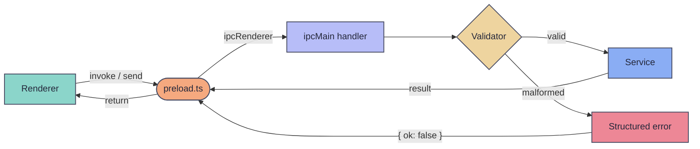

# IPC + Runtime Contracts

SubMiner's Electron app runs two isolated processes — main and renderer — that can only communicate through IPC channels. This boundary is intentional: the renderer is an untrusted surface (it loads Yomitan, renders user-controlled subtitle text, and runs in a Chromium sandbox), so every message crossing the bridge passes through a validation layer before it can reach domain logic.

The contract system enforces this by making channel names, payload shapes, and validators co-located and co-evolved. A change to any IPC surface touches the contract, the validator, the preload bridge, and the handler in the same commit — drift between any of those layers is treated as a bug.

## Message Flow

Renderer-initiated calls (`invoke`) pass through four boundaries before reaching a service. Fire-and-forget messages (`send`) follow the same path but skip the response leg. Malformed payloads are caught at the validator and never reach domain code.

## Core Surfaces

| File | Role |
| --- | --- |
| `src/shared/ipc/contracts.ts` | Canonical channel names and payload type contracts. Single source of truth for both processes. |
| `src/shared/ipc/validators.ts` | Runtime payload parsers and type guards. Every `invoke` payload is validated here before the handler runs. |
| `src/preload.ts` | Renderer-side bridge. Exposes a typed API surface to the renderer — only approved channels are accessible. |
| `src/main/ipc-runtime.ts` | Main-process handler registration and routing. Wires validated channels to domain handlers. |
| `src/core/services/ipc.ts` | Service-level invoke handling. Applies guardrails (validation, error wrapping) before calling domain logic. |
| `src/core/services/anki-jimaku-ipc.ts` | Integration-specific IPC boundary for Anki and Jimaku operations. |
| `src/main/cli-runtime.ts` | CLI/runtime command boundary. Handles commands that originate from the launcher or mpv plugin rather than the renderer. |

## Contract Rules

These rules exist to prevent a class of bugs where the renderer and main process silently disagree about message shapes — which surfaces as undefined fields, swallowed errors, or state corruption.

- **Use shared constants.** Channel names come from `contracts.ts`, never ad-hoc literal strings. This makes channels greppable and refactor-safe.
- **Validate before handling.** Every `invoke` payload passes through `validators.ts` before reaching domain logic. This catches shape drift at the boundary instead of deep inside a service.
- **Return structured failures.** Handlers return `{ ok: false, error: string }` on failure rather than throwing. The renderer can always distinguish success from failure without try/catch.
- **Keep payloads narrow.** Send only what the handler needs. Avoid passing entire state objects across the bridge — it couples the renderer to internal main-process structure.
- **Co-evolve all layers.** When a payload shape changes, update `contracts.ts`, `validators.ts`, `preload.ts`, and the handler in the same commit. Partial updates are treated as bugs.

## Two Message Patterns

**Invoke (request/response):** The renderer calls a typed bridge method and awaits a result. The main process validates the payload, runs the handler, and returns a structured response. Used for operations where the renderer needs a result — lookups, config reads, mining actions.

**Fire-and-forget (send):** The renderer sends a message with no response. The main process validates and handles it silently. Malformed payloads are dropped. Used for notifications where the renderer doesn't need confirmation — UI state hints, focus events, position updates.

## Add a New IPC Action

1. Add the channel constant in `src/shared/ipc/contracts.ts`.
2. Add or extend the payload validator in `src/shared/ipc/validators.ts`.
3. Expose a typed bridge method in `src/preload.ts`.
4. Register the handler in `src/main/ipc-runtime.ts` (or the relevant domain runtime module).
5. Add tests for both valid and malformed payload cases in `src/core/services/*`.
6. Update renderer tests when behavior or state transitions change.

## Runtime State Notes

- Prefer runtime/domain composition via `src/main/runtime/composers/*` and `src/main/runtime/domains/*`. IPC handlers should delegate to composers rather than containing orchestration logic.
- Route shared mutable state updates through transition helpers in `src/main/state.ts` for migrated domains. Direct mutation from IPC handlers bypasses invariant checks.
- Keep IPC handlers thin — they validate, delegate, and return. Business logic belongs in services.

## Troubleshooting

- **Unknown payload in handler:** The validator is not being applied before the handler runs. Check that the channel is routed through `ipc-runtime.ts` with validation, not registered directly.
- **Renderer invoke fails:** Verify the preload bridge method exists and matches the channel constant. Check that the handler is registered and returning (not throwing).
- **Contract drift:** When invoke calls return unexpected shapes, compare the shared contract, validator, preload bridge, and main handler signatures side by side. One of them was updated without the others.

## Related Docs

- [Architecture](/architecture)
- [Development](/development)
- [Configuration](/configuration)
- [Troubleshooting](/troubleshooting)
